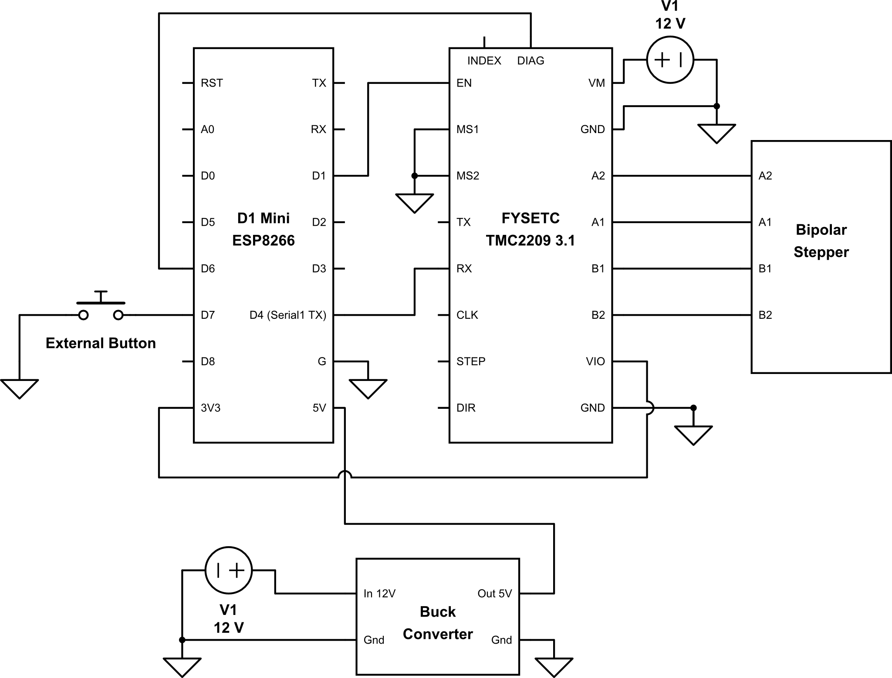

# Motorized tilt control for horizontal slat style blinds

  - Using a standard NEMA 17 stepper motor (choose your torque)
  - Sensorless homing and quiet operation via TMC2209 stepper motor driver
  - Mechanical parts can be off the shelf or 3D printed (STLs included)
  - Optional external button

## Building

If you've never attempted a project like this, I highly recommend first checking out (or attempting) this project: [Motorized_MQTT_Blinds](https://github.com/thehookup/Motorized_MQTT_Blinds). Watch the video, read the issues, etc. to understand the concept and challenges.

## Parts
  - [D1 Mini ESP8266](https://amzn.to/3xdq80V)
  - TMC2209 Stepper Module ([FYSETC 3.1](https://amzn.to/3B5p4gu))
  - 12V DC power supply
  - [Buck converter](https://amzn.to/3qq9SFX)
  - (Optional) Momentary push button
  - Mounting hardware (see section below)
  - Recommend [snapping JST connectors](https://amzn.to/3d2cUNy) for power, button, motor quick disconnects
  - Standard stuff like hookup wire, heatshrink, soldering iron, etc.

## Wiring

## Mounting

  - If not 3D printing, use the parts below. Measure the tilt shaft of your blinds. Mine is square 6.5mm, so 10mm works.
    - [NEMA17 Stepper Bracket](https://amzn.to/3D72wPd)
    - [5mm to 10mm shaft coupler](https://amzn.to/3QiIxA4)
    - [Momentary push button](https://amzn.to/3QwwvDj)
  - The connection between the motor shaft and the tilt shaft is all that's needed to secure. You'll need some wiggle room anyways so I recommend not trying to secure the mounted motor, its weight will be enough.
  - The STLs included for the button housing is for a [12mm DIP style pushbutton](https://amzn.to/3BtQ5fe) that can be mounted on a wall.

## Firmware
  - Update the `HOSTNAME`, `SSID`, and `PASSWORD` variables

## Usage
  - The calibration process moves the blinds to each extreme position, captures the time it takes, and uses this time to determine position. It's accessible in the web ui.
  - Using the web ui:
    - Open a browser to the IP of the D1 mini (port 80)
  - Using the REST API:
    - See the `srv_settings` and `srv_motor_go` functions. The `settings_t` members are accessed by their index.

## Other 
  - [HTML minifier](https://www.willpeavy.com/tools/minifier/) (Watch out for those double quotes!)
  - [FYSETC Wiki](https://wiki.fysetc.com/Silent2209/)
  - A previous version is in the branch [v0_customspool](https://github.com/tomeko/moto-tilt-blinds/tree/v0_customspool). This version uses a custom spool and drives the existing tilt gear mechanism. It requires a bit more parts and work so not really recommended.
