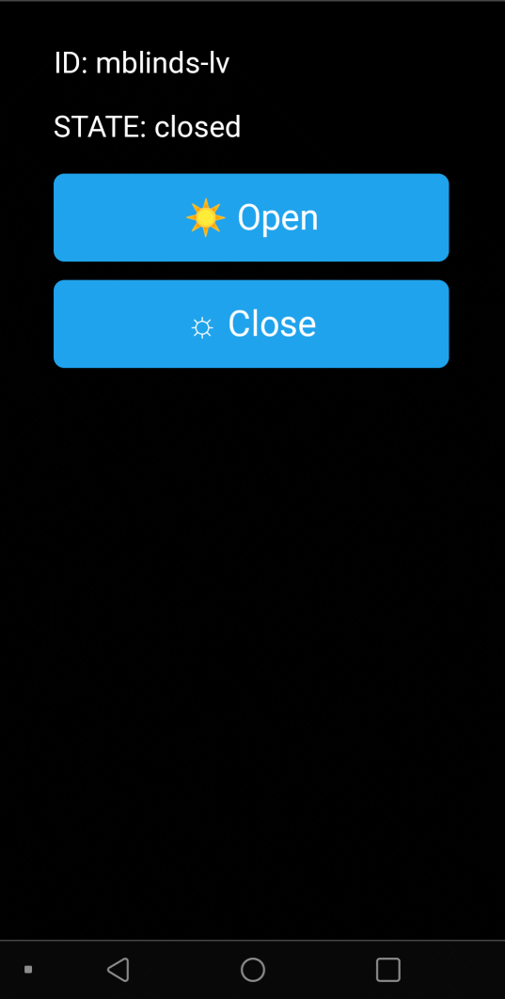

## Summary

Motorized tilt control for horizontal slat-style blinds over Wifi. There are quite a few similar projects & products out there but I couldn't find one that fit the requirements listed below:

### Features
  - **Back-driveable**: Retain manual tilt control of your blinds with existing pull strings in case of power/internet outage.
  - **Keep the stock look**: No clunky or visible parts after installation with no-show profile installation.
  - **Built in control via ESP8266 web interface:** Android OTA updatable firmware, SSDP device discovery.
  - **Low cost:** About $20-$50 per installation 1 
  - **Optional manual control button**

1*As of Dec'21, depending on where you source the parts and how many you build.*

## Assembly/Installation

### Primary Requirements
  - Access to a 3d printer. (I used an Ender3 Pro, all printed with PLA)
  - Familiarity with soldering, wiring, etc.
  - Arduino IDE for primary firmware flash

*Note: This project requires drilling 3 holes into the metal blinds-housing to mount the controller/shaft-spool adapter. Though this won't be visible when be covered-up by the housing shroud. Just something to consider if you're renting/etc*

Link to installation guide. [installation guide](https://github.com/tomeko/moto-tilt-blinds/tree/main/doc)

## BOM

Parts #1-5 listed below are required. The rest (like hookup wire, etc) you may have laying around if you already tinker around with this kind of stuff. Most of the components below are sold online in multi-packs so the final price depends on how many of these you plan to make.

|  | Part  | Description | Optional | Cost | Link
|--|--|--|--|--|--|
| 1 | D1-mini ESP8266 | Main MCU | N | ~$4/ea | [amz](https://www.amazon.com/AITRIP-NodeMcu-Internet-Development-Compatible/dp/B08C7FYM5T) |
| 2 | MPU6050 module | Motor driver | N | ~$3/ea | [amz](https://www.amazon.com/gp/product/B075S368Y2) |
| 3 | GY-521 accel/gyro module | Tilt sensor | N | ~$2/ea | [amz](https://www.amazon.com/MPU-6050-Accelerometer-Gyroscope-Converter-Compatible/dp/B08TH9NH55) |
| 4 | Geared blinds tilt control | Replacement tilt control | N | ~$5/ea  | [amz](https://www.amazon.com/gp/product/B00IIUAALI)
| 5 | 50rpm geared 6V DC motor  | Motor | N | ~$8/ea | [amz](https://www.amazon.com/gp/product/B07XWX9XM3) |
| 6 | M3 set screws | Motor body/shaft set | *a | ~$10/kit | [amz](https://www.amazon.com/gp/product/B073H68PJH) |
| 7 | Hookup wire | signal  | *b | ~$15/kit | [amz](https://www.amazon.com/22AWG-Silicone-OD-Stranded-Insulation/dp/B087TJNJZS) |
| 8 | Power/signal wire (2C)  | For power/button signal  | *c | $15/66ft | [amz](https://www.amazon.com/gp/product/B08C9WNSWN) |
| 9 | 12mm spst button | Manual control | *d | ~$0.25/ea | [amz](https://www.amazon.com/uxcell-12x12x5mm-Momentary-Tactile-Button/dp/B07GNFGC9T) |
| 10 | Thermal/electrical tape  | MCU/case wrap | *e | ~ | ~ |
| 11 | 5V power supply | Power | *f | ~ | ~ |
| 12 | PLA  | For 3d printed parts  | N | ~ | ~ |

<ol type="a">
  <li>Can use  regular short M3 screws</li>
  <li>Standard hookup wire, 22-30awg</li>
  <li>2 conductor is a bit cleaner for running 5V power and button signal</li>
  <li>Only needed if manual button wanted</li>
  <li>Insulated esp8266, motor driver from each other, they aren't mounted in this revision</li>
  <li>Can use any USB wall plug or 5V adapter >500mA, just splice it</li>
</ol>

## TODO/Wishlist
  - MQTT: If you're currently in that ecosystem, it would be nice. However this of course requires an MQTT server, etc. Rev1 is good to go without any server requirements.
  - Multicast operation: Control multiple modules from one. Started implementing this but haven't finished. For now each installation has to be controlled from its own web interface.
  - Better module mounts: Some of the parts (e.g. D1-mini clone) don't have mounting holes, so Rev1 just uses thermal tape to insulate/consolidate parts. Even better a custom PCB for all this, but who has time for that...
  - Rev2: Use 433MHz transceivers with a central hub, battery power (rechargeable, low-power design will be tricky to allow extended use, e.g. > a few months without recharging). Not sure if I'll ever get around to this as the installed profile looks good for now. There are a some windows however that will not have a power outlet within a reasonable distance, so this would be nice.
  
