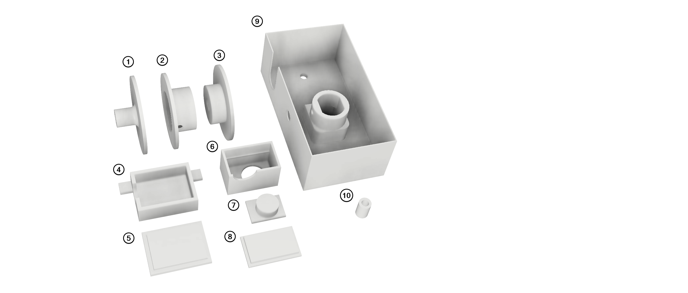
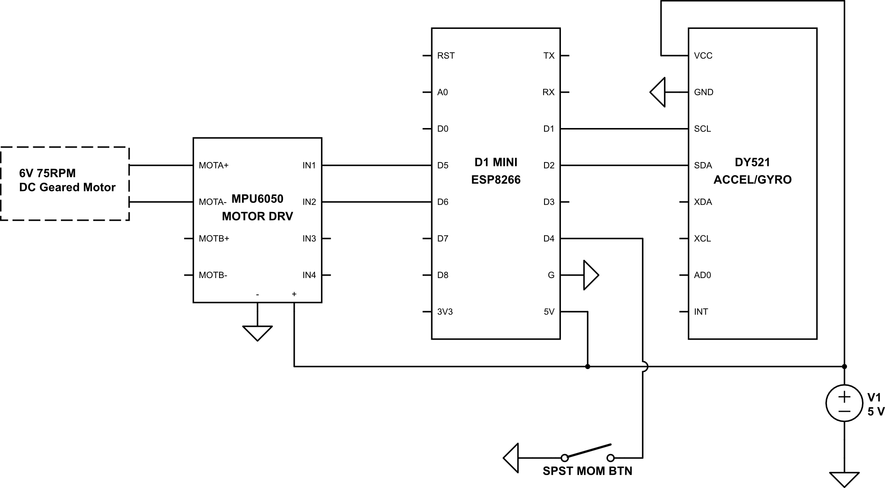
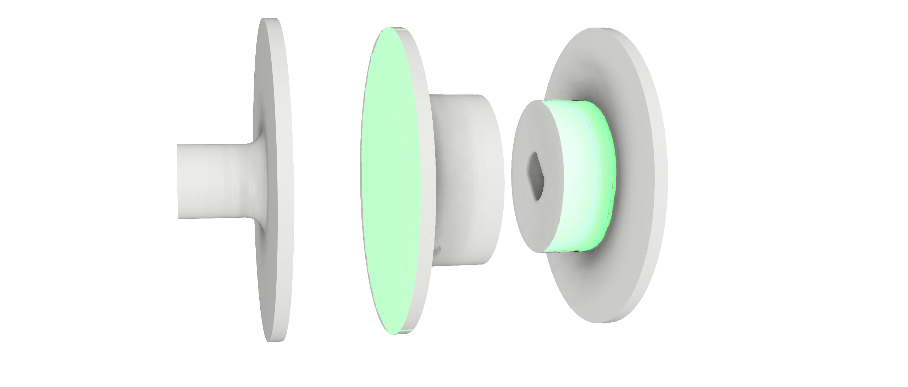
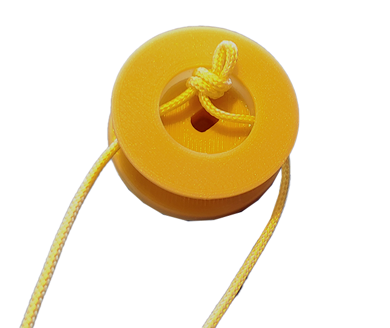
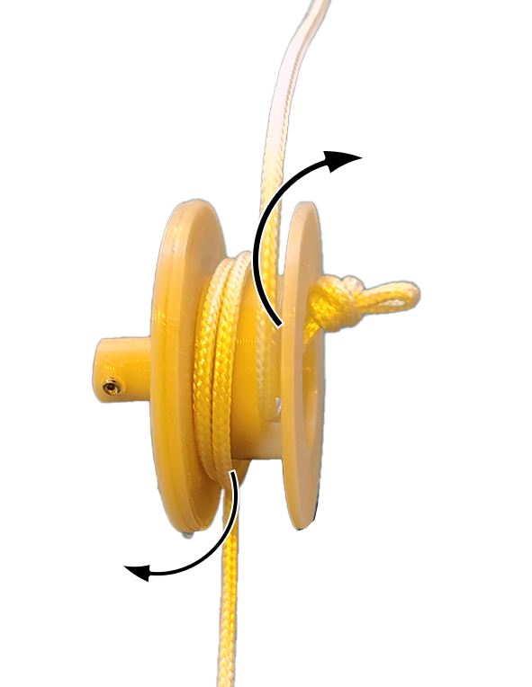
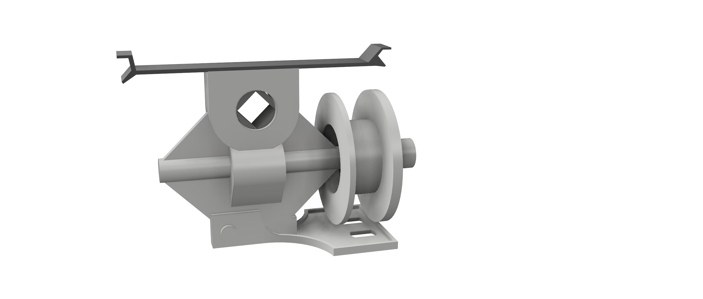

## 1. Horizontal Slat Blinds Overview

 Fig 1:  Existing horizontal slat blinds overview (cords/strings not pictured)

 1.  Front cover shroud
     - Usually a decorative cover made of plastic or wood attached using clips.
 2.  Metal housing
     - This is where the controller box attaches (in the front, between the front cover shroud (1) and housing (2))
 3.  Main drive shaft
 4.  Tilt-gear mechanism
     - Contains a bevel-gear to translate rotation of spool (5) to rotation of the main drive shaft (3)
 5.  Cord spool
     - Cord wrapped around this, connected to shaft of the tilt-gear mechanism (4)

### `moto-tilt-blinds` design concept

  - One way to approach this would be a worm-gear motor driving the main drive shaft (fig 1.3) directly, and removing the tilt-gear mechanism entirely. But that disables manual control as the worm-gear motor is not back-driveable.
  - A small geared motor is placed inline to rotate the cord spool (fig 1.5)
  - There is limited space between the metal housing (fig 1.2) and front cover shroud (fig 1.1) with the required motor orientation, so creating a shaft coupler between the motor and tilt-gear mechanism (fig 1.4) isn't practical.
  - Therefore, the spool that came with the tilt-gear mechanism (fig 1.5) is removed, and we 3D print a custom spool with a built in coupler designed for both the motor shaft and the tilt-gear mechanism shaft.

## 2. BOM

Parts #1-5 listed below are required. The rest (like hookup wire, etc) you may have laying around if you already tinker around with this kind of stuff. Most of the components below are sold online in multi-packs so the final price depends on how many of these you plan to make.

|  | Part  | Description | Optional | Cost | Link
|--|--|--|--|--|--|
| 1 | D1-mini ESP8266 | Main MCU | N | ~$4/ea | [amz](https://www.amazon.com/AITRIP-NodeMcu-Internet-Development-Compatible/dp/B08C7FYM5T) |
| 2 | MPU6050 module | Motor driver | N | ~$3/ea | [amz](https://www.amazon.com/gp/product/B075S368Y2) |
| 3 | GY-521 accel/gyro module | Tilt sensor | N | ~$2/ea | [amz](https://www.amazon.com/MPU-6050-Accelerometer-Gyroscope-Converter-Compatible/dp/B08TH9NH55) |
| 4 | Geared blinds tilt control | Replacement tilt control | N | ~$5/ea  | [amz](https://www.amazon.com/gp/product/B00IIUAALI)
| 5 | 50rpm geared 6V DC motor  | Motor | N | ~$8/ea | [amz](https://www.amazon.com/gp/product/B07XWX9XM3) |
| 6 | M3 set screws | Motor body/shaft set | *a | ~$10/kit | [amz](https://www.amazon.com/gp/product/B073H68PJH) |
| 7 | Hookup wire | signal  | *b | ~$15/kit | [amz](https://www.amazon.com/22AWG-Silicone-OD-Stranded-Insulation/dp/B087TJNJZS) |
| 8 | Power/signal wire (2C)  | For power/button signal  | *c | $15/66ft | [amz](https://www.amazon.com/gp/product/B08C9WNSWN) |
| 9 | 12mm spst button | Manual control | *d | ~$0.25/ea | [amz](https://www.amazon.com/uxcell-12x12x5mm-Momentary-Tactile-Button/dp/B07GNFGC9T) |
| 10 | Thermal/electrical tape  | MCU/case wrap | *e | ~ | ~ |
| 11 | 5V power supply | Power | *f | ~ | ~ |
| 12 | PLA  | For 3d printed parts  | N | ~ | ~ |

<ol type="a">
  <li>Can use  regular short M3 screws</li>
  <li>Standard hookup wire, 22-30awg</li>
  <li>2 conductor is a bit cleaner for running 5V power and button signal</li>
  <li>Only needed if manual button wanted</li>
  <li>Insulated esp8266, motor driver from each other, they aren't mounted in this revision</li>
  <li>Can use any USB wall plug or 5V adapter >500mA, just splice it</li>
</ol>

### Other

  - Because the ESP8266 will be externally powered, it might be a good idea to find/make a micro-usb cable with no power for the initial firmware flash (if you've already wired everything up). You can do this by carefully splicing a micro-usb and cutting the (usually) red wire. The D1-Mini ESP8266 might have circuitry to handle this, but it's always good to be on the safe side.

  - Drilling into the metal front cover shroud (fig 1.1) is probably the most difficult part of this installation. If you don't already have a center punch I highly recommend investing in one ([even a cheap $5 one](https://www.harborfreight.com/spring-loaded-center-punch-621.html))

  ## 3. 3d-printed parts

  All parts to 3d print are illustrated and described below, and the files are found in the `/stl` folder in this repo. I used an Ender3 Pro with a pretty stock/typical setup (0.4mm nozzle, 1.75mm PLA). 

 Fig 2:  3d printed parts

  1. Spool (1/3) Motor shaft coupler side
  2. Spool (2/3) Side 1
  3. Spool (3/3) Side 2, gear-tilt shaft coupler side
  4. DY521 case (1/2): Body
  5. DY521 case (2/2): Cover
  6. Button case (1/3): Body
  7. Button case (2/3): Button press top
  8. Button case (3/3): Cover
  9. Controller case: Built in motor mount, mounting holes, wire cutout. Note: there is no top here (not really needed) as it will be covered by the front cover shroud (fig 1.1)
  10. Controller case spacer: The case isn't able to fit flush with the metal housing (fig 1.2) so these spacers are used with the 2 M3 mounting bolts when attaching to the housing.

  - Parts 6-8 are optional. Print these if you want the manual single push button to toggle/move between presets (e.g. open/close blinds)
  - Parts 1 and 3 should be printed with 100% infill, as the shaft couplers need the added strength. (I used Cura's "Standard Quality", and set infill to 100%)
  - For the rest, I used Cura with it's default "Low Quality" (20% infill)
  - Estimated print time is about 2-3 hours depending on your setup.

  ## 4. Wiring

 Fig 4:  Wiring diagram

Notes:
  - Wiring between the ESP8266 and the motor driver should be short, as the ESP8266 and motor driver will be sandwiched on top of each other (insulated by thermal or electrical tape, BOM 2.10)
  - Wiring between the motor driver and motor should enough to reach the motor itself when mounted. 3" should be plenty.
  - Wiring between the ESP8266 and the tilt sensor (DY521) should be 6" max. The tilt sensor will be mounted on the top blind(slat). Wiring shouldn't be longer than 6" as the tilt sensor module uses I2C and longer data/clock runs could mess up comms
  - If you decide to include the manual pushbutton, make sure your signal/gnd wires are long enough for your desired placement. Decide where you would like the push button mounted, and make a rough measurement. Also you only need 2 wires here, so using a 2conductor wire will be cleaner (BOM 2.8)
  
## 5. Firmware

NOTE: For the initial firmware flash, you might be able to get away with flashing before wiring everything up. But it's recommended to find/make a micro-usb cable with the power wire (red usually) cut for this. Also useful for  serial debugging. The D1-Mini ESP8266 might have circuitry to handle both external and USB power, but it's always good to be on the safe side.

### Requirements

Make sure you have all of the below installed.

  - [Arduino IDE](https://www.arduino.cc/en/software)
  - [ESP8266 library and boards](https://github.com/esp8266/Arduino)
  - Other libraries:
    - [MPU6050_light](https://github.com/rfetick/MPU6050_light)
      - For the DY521 accel/gyro module
    - [elapsedmillis](https://github.com/pfeerick/elapsedMillis)
      - For timing
    - [ESP_EEPROM](https://github.com/jwrw/ESP_EEPROM)
      - Better non-volatile r/w on ESP
    - [ArduinoOTA](https://github.com/jandrassy/ArduinoOTA)
      - OTA update functionality. If for some reason you have issues with this, you can comment out the line `#define USA_OTA` in `mblinds_fw.ino:17`. I highly recommend not disabling this (for the ease of updating firmware), but the option is there if desired.
      - According to the [docs](https://arduino-esp8266.readthedocs.io/en/3.0.2/ota_updates/readme.html), you need to flash an initial firmware (`BasicOTA.ino`) first, but I don't know if this is necessary. Will update here when I find out.

In `mblinds_fw.ino`, you need to update some main definitions/declarations, around lines ~10-30. Descriptions below:
  - `#define RPM 75`
    - Set to whatever RPM motor you chose
  - `const char* HOSTNAME = "mblinds1";`
    - Set a unique hostname, important if planning on installing multiple of these
  - `const char* SSID = "ssid";`
  - `const char* PASSWORD = "pw";`
    - Set your wifi ssid/password here

## 6. Assembly

### 6.1 Assemble new spool/coupler
The replacement spool/coupler is printed in 3 pieces, and needs to be superglued together.
  
 Fig 6.1.1:  Apply superglue to the green shaded areas and push pieces together

 
 Fig 6.1.2:  Assembled/glued spool

### 6.2 Assemble controller

*(todo/coming soon)*

### 6.3 Remove miniblinds
  1. Before starting:
     - Tilt the blinds to a horizontal position
     - Pull up the blinds halfway, lock them in place. This helps when taking them off and moving them to a work area.
     - Remove the knobs at the end of the tilt cords. These are usually kept in place by a knot on one end, just untie that knot and set the knobs aside.
  2. First, remove the front cover shroud. It's held in place by plastic clips that clip in from the top. So grab the shroud with two hands, and carefully slide it up until the clips unlatch. Set aside.
  3. The blinds assembly is usually mounted with metal brackets attached to the wall. On each bracket (left and right), there should be a front piece (facing you) that folds up and down locking the housing in place. You may need to use a screwdriver to pop them up. Once these are both popped up, you should be able to slide them straight out (towards you).
  4. Pull the entire assembly out, and take it to a work area.

### 6.4 Remove existing tilt mechanism and replace old spool
  1. Note the placement of the tilt-gear mechanism (fig 1.4). It's usually on the left side. To free it we need to pull out the main drive shaft (fig 1.3). Pull the main drive shaft (from the right side in this case), enough so that it comes out of the tilt-gear mechanism. There might be a small rubber washer on the main drive shaft you have to remove first.

 
 Fig 6.4.1:  Pulling out the shaft to free the tilt-gear mechanism

  2. The tilt-gear mechanism is set in place from a rectangular plastic piece on the bottom. You should be able to just pop it off. Once removed, pull the cord out through the housing.

  3. Prepare the replacement tilt-gear mechanism
     - Remove the existing spool (which will have a winded cord) by pulling it off.
     - Here you can either use the cord that came with the new tilt-gear mechanism, or use the original cord. Either way, remove/unwind the cord from whichever spool you choose. We're going to wind up this cord to our new spool/coupler.
  4. Wind the cord on the new spool/coupler.
     - Fold the new cord in half to make two equal length sides.
     - At the loop-end of the cord, make a simple overhand loop knot. Pull each loose end through the two small holes on the new spool/coupler. See figure below for example.

 
 Fig 6.4.2:  Threading the cord through the new spool/coupler

   - Wind each side one at a time in opposite directions five times. Try to keep each winding on one side if possible. You don't want the winding to end up being tangled, so take your time here and try a few times if necessary. At the end, you should be able to hold the spool in the middle, and pull each side to make the spool turn easily. See figure below for illustration on the opposite winding directions.

  
 Fig 6.4.3:  Winding the cord. Wind one side 5 times, then the other side 5 times in the oppoosite direction

5. After the cord is wound on the spool, install the spool on the new tilt-gear mechanism, by pushing the shaft into the shaft-end coupler with the motor-coupler end sticking out (see figure below for orientation). Also, thread the two cords through the holes on the bottom square plate of the tilt-gear mechanism (this bottom square plate can be swiveled up/down to help)

 
 Fig 6.4.4: Spool/coupler installed on new tilt-gear mechanism (cords not shown)

6. Install the new tilt-gear and spool mechanism
  - First you'll need to pull the cords through the bottom hole of the housing
  - Position the new assembly back into it's correct place. The bottom square plate of the tilt-gear mechanism should line-up/snap to the rectangular hole on the housing.
  - Slide the main drive shaft back through the tilt-gear mechanism. If you had the rubber washer on the main drive shaft, put it back on.

### 6.5 Mount controller

*(todo/coming soon)*

### 6.6 Mount tilt-sensor and optional button

*(todo/coming soon)*

## 7. Operation

*(todo/coming soon)*

### 7.1 Web and REST interface

*(todo/coming soon)*
### 7.2 Position calibration

*(todo/coming soon)*

